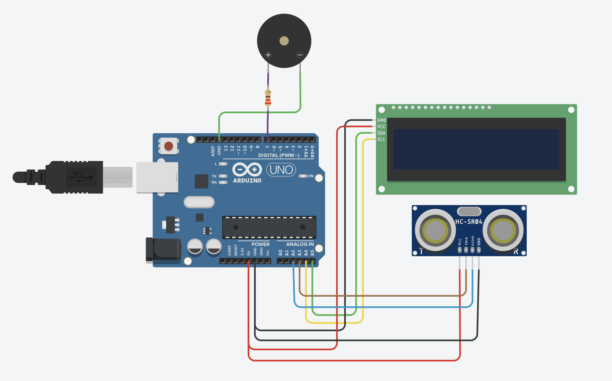
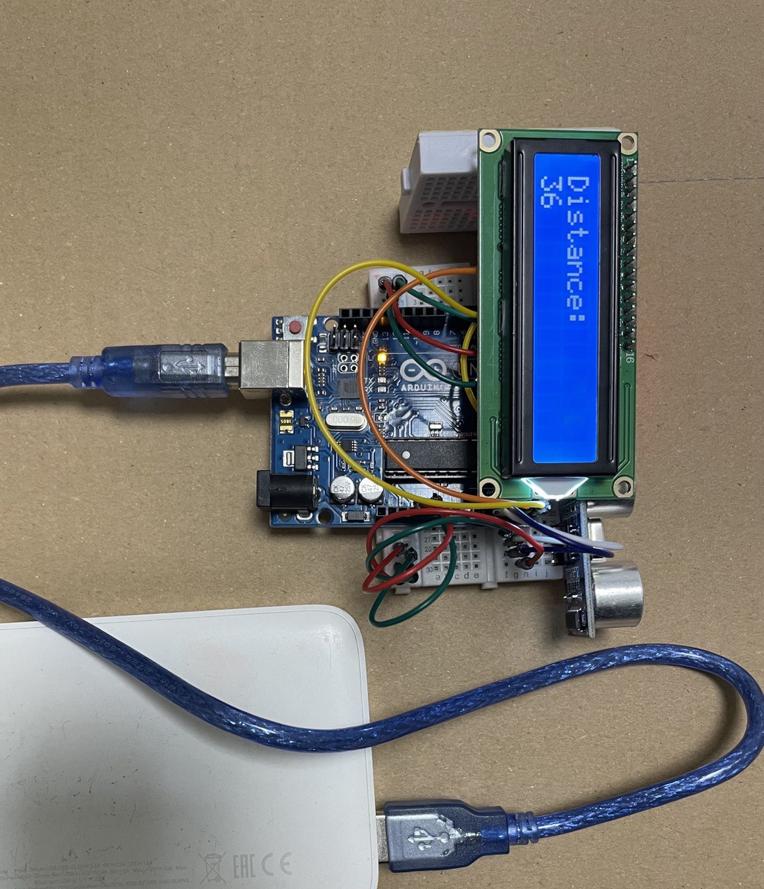
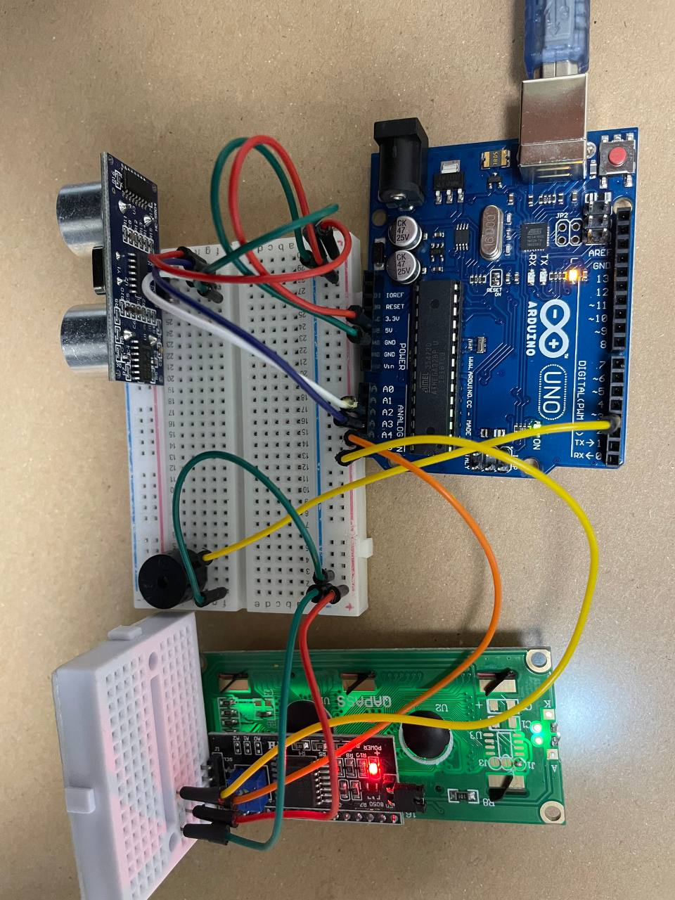
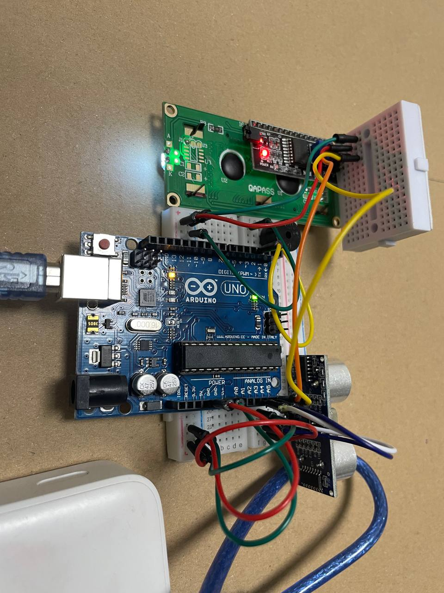

# Ultra Sonic Sensor Interfacing

## Task
```
Connect an ultrasonic sensor to detect any objects from the front side and display the distance on LCD screen , also the module should fire an alarm when the object is 30 cm or closer using buzzer so that the siren sound is related to the distance (smaller distance generate faster beeps).
```

## Components

* Arduino Uno
* Ultrasonic Sensor
* 16x2 LCD Screen ( I2C )
* Buzzer
* Breadboard
* Jumper Wires
* Resistors

## Circuit Diagram



## Assembled Circuit

<p float="left">
  
   
  
</p>

          

## Project Demo

    
[Watch Video](https://www.loom.com/share/c36953c4ccf54f7eb345afdf09b8bf03)

## Code

[hw2.ino](hw2.ino)

## Issues

* Ultrasonic Sesnor Instabilty ([#1][i1])
* Make Buzzer Beeping Non-Blocking ([#2][i2])

[i1]: https://github.com/ibraheemalayan/interfacing-ultrasonic-sensor/issues/1
[i2]: https://github.com/ibraheemalayan/interfacing-ultrasonic-sensor/issues/2


